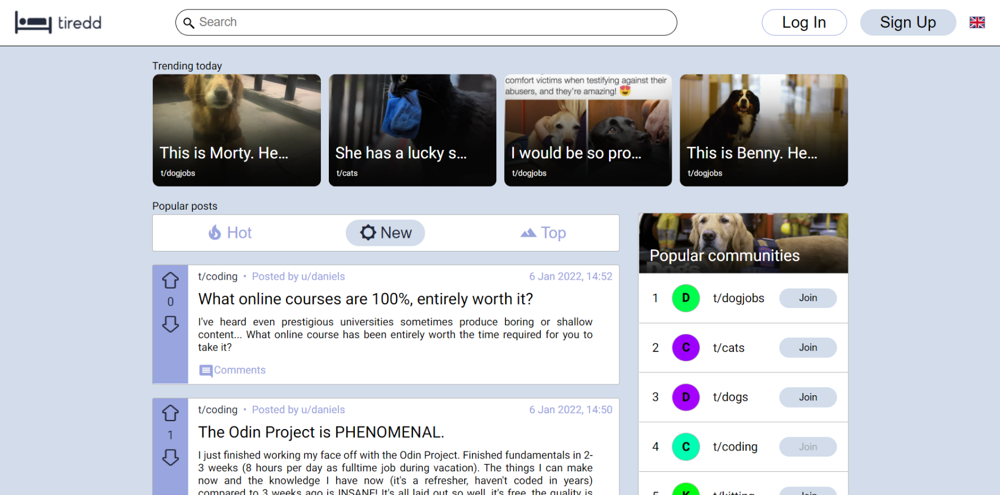
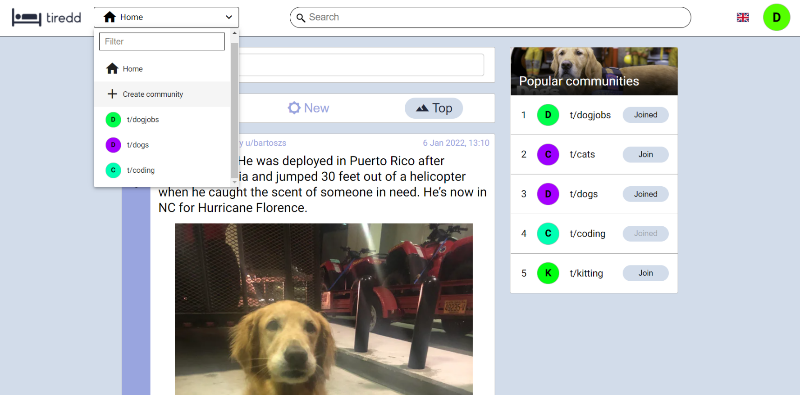
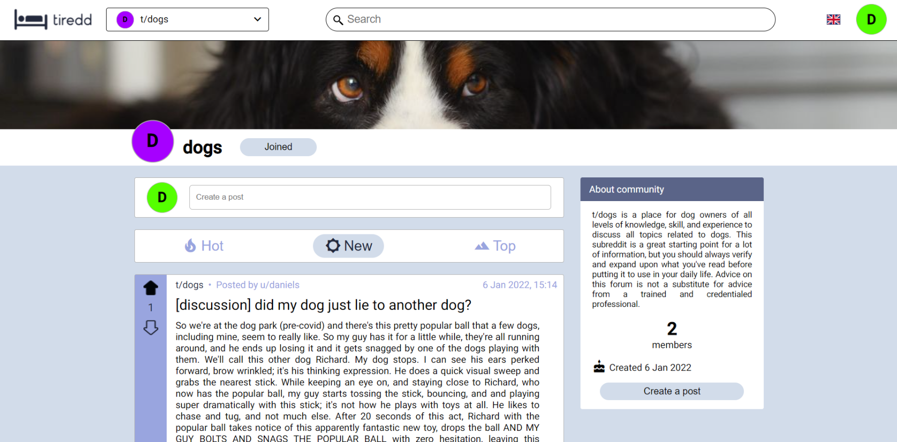
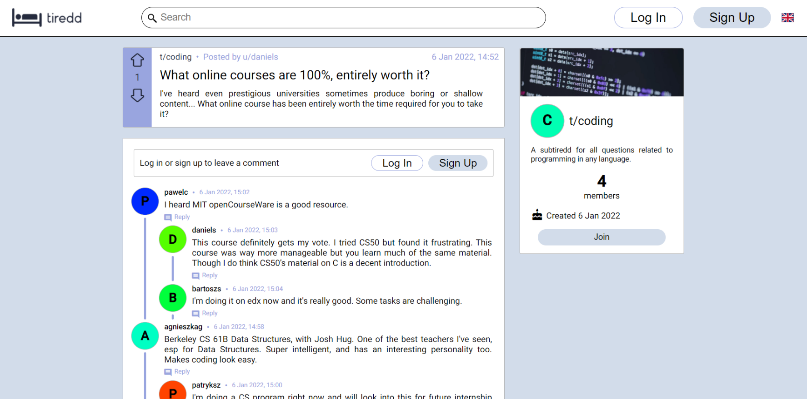
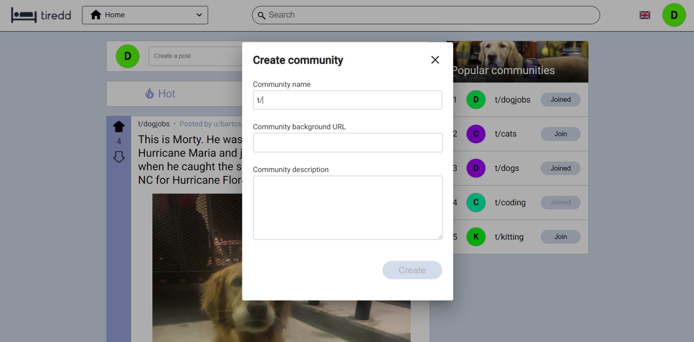
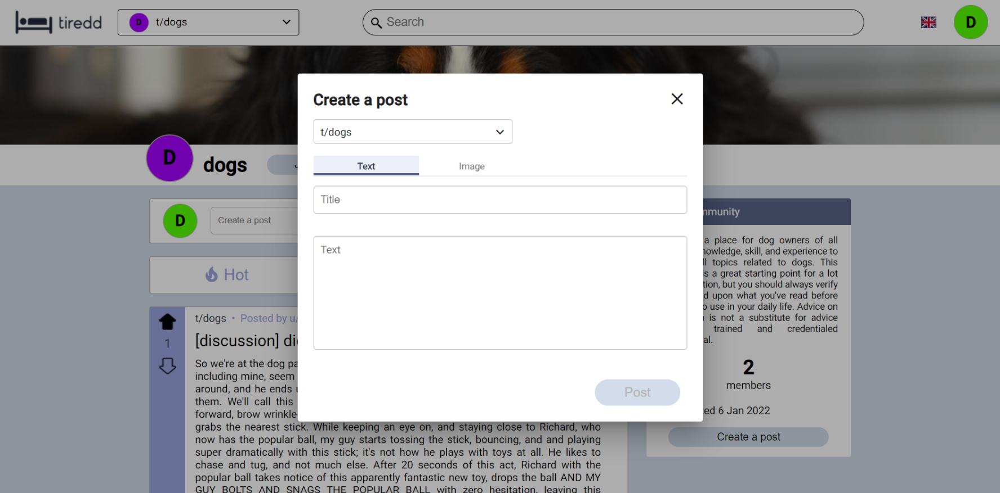
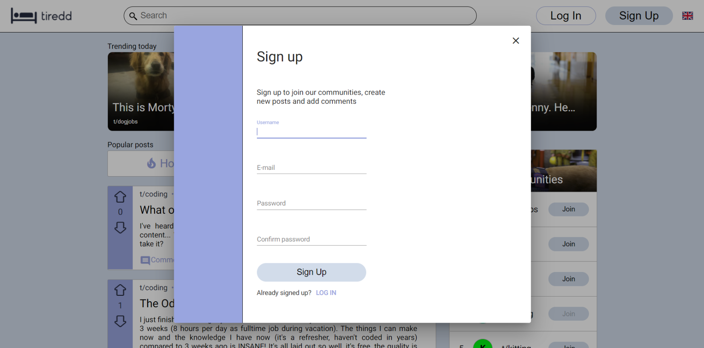

# tiredd

Social network heavily inspired by [Reddit](https://www.reddit.com/). Tiredd allows users to browse or create posts and comments
in various subtiredds. 

Main features:

* Scroll the hottest, top and newest posts from all communities endlessly
* Creating subtiredds dedicated to your interests
* Sharing your thoughts in posts and comments
* Voting for posts that speak to you
* Available in two languages: English and Polish

## Authors

* **Agnieszka Ganowicz**
* **Paweł Cembaluk**
* **Bartosz Starosta**

## Built with

* [Visual Studio](https://visualstudio.microsoft.com/)
* [ASP.NET](https://dotnet.microsoft.com/en-us/apps/aspnet)
* [Entity Framework](https://docs.microsoft.com/en-us/ef/)
* [WebStorm](https://www.jetbrains.com/webstorm/)
* [Angular](https://angular.io/)
* [MySQL](https://www.mysql.com/)
* [Docker](https://www.docker.com/)

## Screenshots

|  |
|:----------------------------------------:|
|  |
|  |
|  |
|  |
|  |
|  |